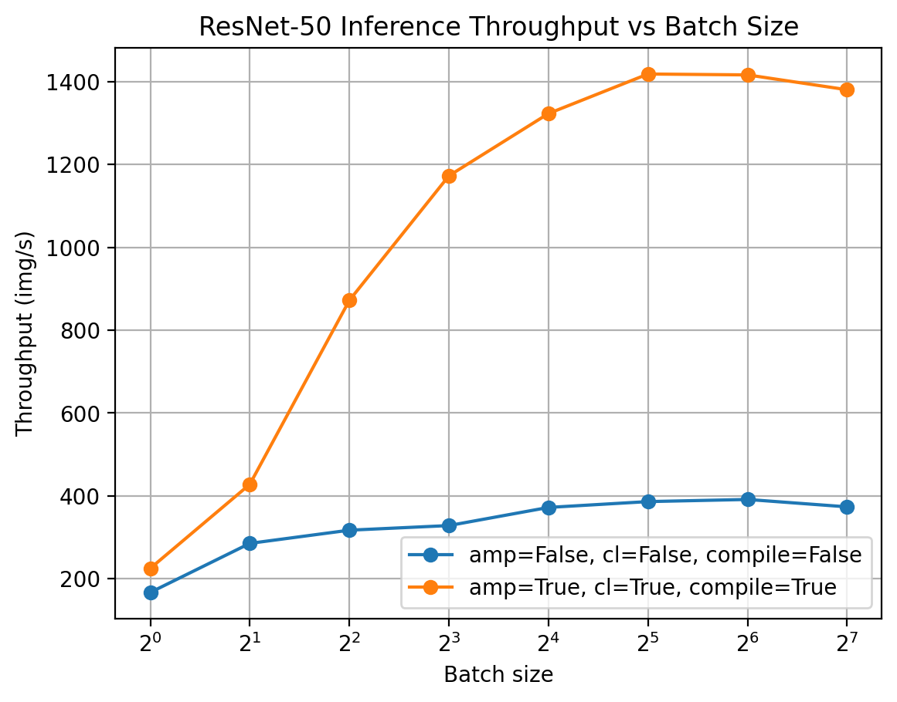
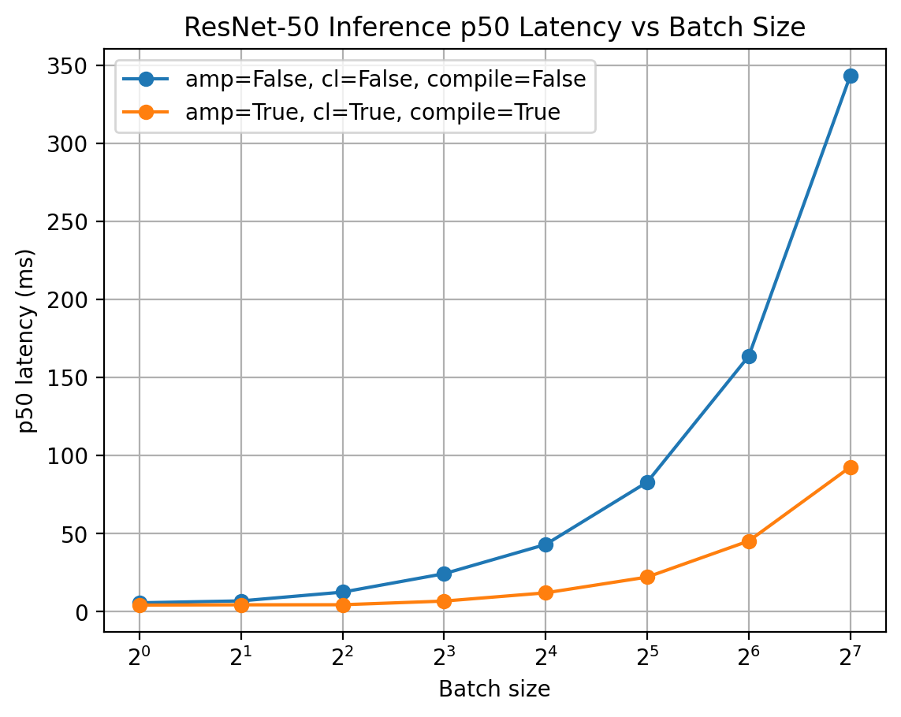

# PyTorch GPU Workload Efficiency Benchmark Suite

A reproducible benchmarking and profiling toolkit for evaluating **GPU training and inference performance** of deep learning workloads in PyTorch.  
This project focuses on **throughput, latency, and efficiency optimization** using framework-level and memory-level techniques commonly used in production ML systems.

---

## Motivation

Modern deep learning performance is often limited not by model accuracy, but by **GPU utilization, memory efficiency, and framework overhead**.

This project was built to:
- Analyze **training vs inference bottlenecks**
- Profile GPU workloads to understand **where time is spent**
- Apply and quantify **performance optimizations**
- Produce **reproducible, measurable results** suitable for performance engineering workflows

---

## Features

- **Inference benchmarking**
  - Throughput (images/sec)
  - Latency (p50 / p95)
- **Micro-training benchmarking**
  - Iteration time and throughput
- **Optimization toggles**
  - Automatic Mixed Precision (AMP)
  - Channels-last memory format
  - `torch.compile` (PyTorch 2.x)
- **Profiling & diagnostics**
  - `torch.profiler` with TensorBoard traces
- **Automation**
  - Batch-size sweep
  - CSV / JSON results
  - Auto-generated Markdown reports

---

---

## Quick Start (Google Colab – GPU)

1. Open `notebooks/GWE_Benchmarks_Colab.ipynb`
2. Runtime → **Change runtime type** → **GPU**
3. Run all cells top-to-bottom

The notebook:
- installs Colab-compatible dependencies
- runs inference and training benchmarks
- generates profiler traces
- produces sweep plots and reports

---

## Benchmarks

### Inference Metrics
- **Throughput**: images per second (higher is better)
- **Latency**: p50 / p95 milliseconds (lower is better)

### Training Metrics
- Micro-training iteration time
- Training throughput (images/sec)

---

## Results Snapshot (ResNet-50, batch size = 32)

**Inference**
- Baseline (FP32):  
  - ~384 images/sec  
  - p50 latency ~83 ms
- Optimized (AMP + channels-last + `torch.compile`):  
  - ~1506 images/sec  
  - p50 latency ~21 ms  
  - **~3.9× throughput improvement**  
  - **~74% latency reduction**

**Micro-Training**
- Baseline: ~109 images/sec
- Optimized: ~346 images/sec  
- **~3.2× throughput improvement**

---

## Profiling

TensorBoard trace captured using `torch.profiler` during optimized inference.

**Observations**
- Reduced kernel execution time after AMP + compilation
- Improved GPU utilization
- Lower framework and memory overhead

---

## Batch Size Sweep

### Throughput vs Batch Size

### p50 Latency vs Batch Size

**Interpretation**
- Throughput increases with batch size until GPU saturation
- Latency grows with batch size due to increased per-step work
- Highlights the trade-off between **latency-sensitive** and **throughput-oriented** workloads

---

## Key Performance Findings

- Baseline FP32 inference was memory-inefficient and under-utilized GPU compute
- AMP reduced compute and memory pressure
- Channels-last improved convolution memory access patterns
- `torch.compile` reduced Python and framework overhead
- Combined optimizations delivered **near-4× inference speedup** with significant latency reduction

---

## Technologies Used

- **PyTorch**
- **CUDA / GPU execution**
- **torch.profiler + TensorBoard**
- Python, NumPy, Pandas, Matplotlib

---

## Future Improvements

- Nsight Systems integration for kernel-level analysis
- Multi-GPU scaling experiments
- Model coverage beyond ResNet / EfficientNet
- Memory-bandwidth vs compute-bound classification

---

